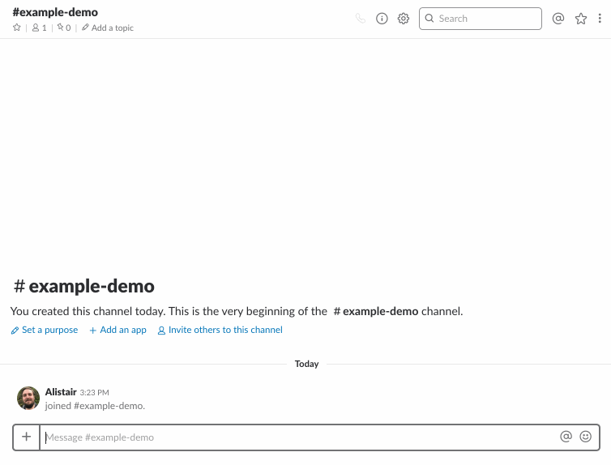

# Basic Example



## Setup

1. Copy this directory

2. Create a `.env` file in the root directory, with a `SLACK_BOT_TOKEN` for the
   slack bot to connect to your slack workspace

### Docker

Use `docker-compose` to build the environment and run the bot.
```
docker-compose build service
docker-compose run service
```

### Locally

Make sure you have Node.js and npm available. Install dependencies and run the
bot:
```
npm install
npm start
```


## Commands

### help

The details noted here.

### ping

Checks that the bot's alive. If it replies `PONG`, you're good to go.

### my name is `your-name`

Says hello!


## Contributing

Pull requests on this repository are very welcome. There is test and linting
tooling in place. Formatting is provided by prettier. This project uses the same
linting and testing tooling as provided to any bots which use these scripts.

### Docker

Use `docker-compose` to build the environment, and run tests and lint.
```
docker-compose build test
docker-compose run test    # Test and lint
```

### Locally

Make sure you have Node.js and npm available locally. Install dependencies and
run the test and linting tasks.
```
npm install
npm test        # Run all tests with jest
npm run lint    # Lint the codebase with eslint
```
